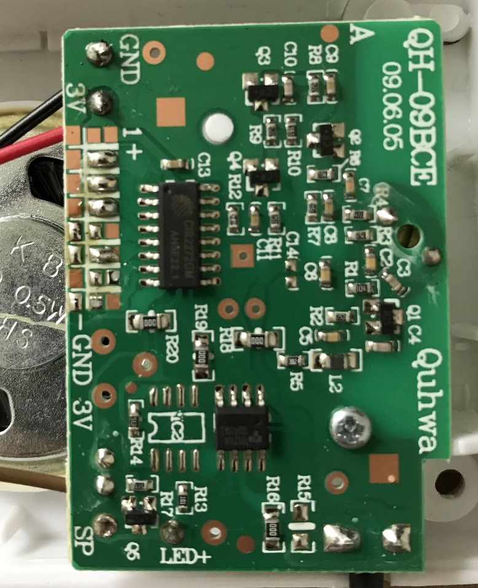

# node-quhwa-gpio

Listen to events from a modified quhwa doorbell connected via gpio

docker run -it -v /sys:/sys --network host node-quhwa-gpio:latest



# Compose

```
version: "3"
services:
  quhwa-gpio:
    build: https://github.com/bodav/node-quhwa-gpio.git
    network_mode: host
    volumes:
      - /sys:/sys
    environment:
      - GPIOPIN=7
      - "WEBHOOKURL=http://localhost:51828/?accessoryId=doorbellSensor&state=true"
```
